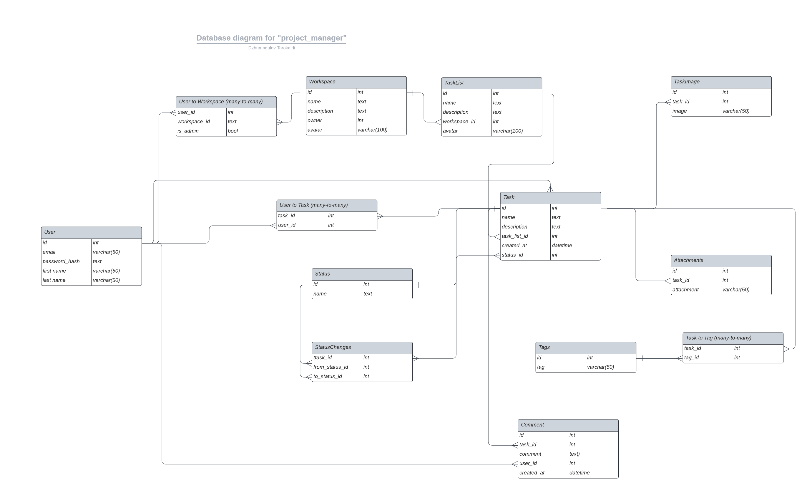

# Backend for project organizing and task tracking tool

The backend server uses the Django framework.
This documentation explains how to configure, launch and test backend server.

Here you can see [database design](database_design.pdf)

**Note:** This documentation for local development only, see DEPLOY.md for deploying documentation.

**Assumption:** we suppose that we start in `project_manager` directory.

## Database design


## Enviroment requirements

### Packages
First, you should install poetry. [See how to install](https://python-poetry.org/docs/#installation)

Then install required packages, poetry will automatically create virtual enviroment:

```
poetry install
```

### Database

You need to install Postgresql, django supports PostgreSQL 12 and higher.

[How to install on Arch](https://wiki.archlinux.org/title/PostgreSQL#Installation)

[How to install on Ubuntu](https://www.digitalocean.com/community/tutorials/how-to-install-postgresql-on-ubuntu-20-04-quickstart)

[How to install on Windows](https://www.postgresqltutorial.com/postgresql-getting-started/install-postgresql/)

### Redis

You need to install redis in order to use celery.

[How to install](https://redis.io/docs/getting-started/installation/)

## Configuring

To configure backend server, you need to:

- set some environment variables
- create/use a postgresql database
- create/use a redis database

### Environment variables

Backend server requires some environment variables to be set for running
correctly.


For django configuration:

- *SECRET_KEY* : the Django secret key is used to provide cryptographic signing
- *ALLOWED_HOSTS* : host names that server can serve, you can copy from .env.example

For database configuration:

- *DATABASE_URL* : postgresql database url, see format of url in .env.example

For redis configuration:

- *REDIS_HOST* : redis database url, you can copy from .env.example


## Migrations

Run following command to migrate database

```
python3 manage.py migrate
```


## Launching backend server

Run celery worker
```
python3 -m celery -A config worker -l info
```

Then launch django server
```
python3 manage.py runserver
```

## Testing

Run pytest

```
pytest
```
